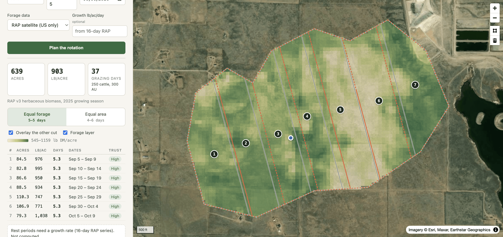

# Paddock Planner

Draw a pasture. Get virtual paddocks that follow the feed instead of the fence line.

Satellites say what grew. Collars say what was eaten. The difference is what's left, and the boundary should follow it.



## What it does

You draw a pasture polygon (up to 500 vertices and 10,000 acres, the same limits as the Nofence app in the US), drop a water point, and enter the herd. The planner reads herbaceous forage for every 30 m pixel inside the boundary from the Rangeland Analysis Platform, then cuts the pasture into strips of **equal forage rather than equal area**, ordered from the water point, with a start and end date for each strip and a confidence grade that says how much to trust the number. Strips export as GeoJSON, which is the shape a virtual-fence app ingests.

Physical fences get built where they are cheap to build, so paddocks end up equal-area at best and the herd spends four days in one and nine in the next. A virtual fence costs nothing to redraw. That is the whole reason to do this: the boundary can be wherever the grass says it should be, and it can move every few days without anyone stringing wire.

The app shows the equal-area cut side by side so the difference is visible. On the synthetic demo pastures the equal-area strips range from about 2 to 10 grazing days each; the equal-forage strips are all within a few percent of one another.

## What it can't see

This is the part to read first.

**It measures production, not standing crop.** The annual RAP product says how much herbaceous biomass grew last season. It does not know what has already been eaten this year. The honest way to get standing crop is to subtract what the animals removed, and the only instrument that knows that at pasture resolution is the collar. The grazing heat maps Nofence already produces are the missing input. That is the reason this tool belongs inside a virtual-fence product rather than next to one.

**Trees hide grass.** Above roughly 30% tree cover the satellite is looking at canopy, and the herbaceous estimate is not trustworthy. Strips with tree cover are graded *medium* or *low* and say why. The California preset is chosen because coast live oak makes this failure visible.

**It counts grass, not browse.** RAP's herbaceous number leaves out shrubs and low branches. Goats eat those. For goats the plan under-counts available feed and says so.

**30 m pixels, annual latency.** The within-season 16-day product exists (Earth Engine only) and is wired in as an optional growth-rate input for rest periods; without it the planner reports rest periods as "not computed" rather than guessing.

**RAP is US-only.** The Norway preset runs on a synthetic surface and is labelled as such everywhere. A European source (Sentinel-2 plus a biomass model) is the obvious next step, and the code has a one-method interface for adding it.

**Intake is a planning number.** 2.6% of body weight per day in dry matter, the NRCS convention. Real intake moves with forage quality, weather and lactation. Utilisation ("take half, leave half") is a slider, not a fact.

## How it works

1. Project the pasture to its UTM zone and lay a 30 m grid over it.
2. Fill the grid from a forage source. `RAPSource` window-reads two public Cloud-Optimised GeoTIFFs over HTTP (annual herbaceous biomass, and fractional cover for the tree and shrub flags). No download, no API key. `SyntheticSource` is a stand-in for offline demos and tests, never a fallback for real data.
3. Choose an axis: the long side of the pasture's minimum rotated rectangle, oriented so strip 1 is at the end nearest the water.
4. Project every pixel onto the axis, sort, walk the cumulative forage and cut wherever it crosses *k/N* of the total. Cuts land halfway between pixel columns so every pixel belongs to exactly one strip and totals are conserved exactly.
5. Intersect each band with the pasture polygon. Concave pastures can produce a strip in two pieces; the strip is flagged and its confidence drops, because two pieces means two water problems.
6. Grazing days per strip = forage × utilisation ÷ herd demand. Dates run back to back from the start date. If a growth rate is supplied, each strip also gets the rest it needs to regrow what was taken, and the planner says whether strip 1 will be ready when the herd gets back to it.

Everything above is plain NumPy and Shapely on a few thousand pixels. A 640-acre pasture plans in about 200 ms after the data is in memory.

## Run it

Backend (Python 3.11):

```
cd backend
pip install -r requirements-dev.txt
python -m pytest            # 22 tests, about a second
uvicorn app.main:app --reload --port 8000
```

Frontend (Node 22):

```
cd frontend
npm install
npm run dev                 # http://localhost:5173, proxies /api to :8000
npm run build               # after this the API serves the app itself from /
```

Or the whole thing in one container: `docker build -t paddock-planner . && docker run -p 8000:8000 paddock-planner`.

Before a demo on real data: `cd backend && python -m scripts.check_rap colorado` confirms the RAP rasters are reachable and prints the year found. RAP occasionally moves hosts; the URLs are environment variables (`RAP_BIOMASS_URL`, `RAP_COVER_URL`). For rest periods, `python -m scripts.fetch_growth colorado 2026-04-01` pulls the 16-day series from Earth Engine (needs `earthengine-api` and an authenticated account) and prints the growth rate to paste into the UI.

## API

`POST /api/plan`

```json
{
  "pasture": {"type": "Polygon", "coordinates": [[[-105.04, 40.86], ...]]},
  "water": [-105.041, 40.857],
  "herd": {"species": "cattle", "head": 250, "avg_weight_lb": 1200},
  "utilization": 0.5,
  "n_strips": null,
  "target_days_per_strip": 5,
  "start_date": "2026-09-10",
  "source": "rap",
  "growth_lb_ac_day": null
}
```

Returns pasture totals, the equal-forage plan and the equal-area plan (each a list of strips with geometry, acres, lb/acre, grazing days, dates, confidence and reasons), a PNG of the forage surface with its corner coordinates for the map, the assumptions used, and the data source's own notes about itself.

## How this would fit into Nofence

The stack here mirrors what Nofence's engineering posting lists, on purpose.

The forage ingest is a scheduled job: pull the 16-day RAP tiles for every active pasture's bounding box and write per-pasture, per-period biomass into ClickHouse next to the collar time series (Windmill is the natural place for the schedule). Pastures and strips are PostGIS rows; the strip cut is a pure function of a pasture, a raster and a herd, so it runs in the same Python service as everything else. The app screen is the strip-grazing screen that already exists, plus a forage layer and a "suggest strips" button that fills the boundaries in. The collar heat map becomes an input rather than a report: forage grown minus forage grazed, per pixel, is the standing-crop layer that makes the day counts honest.

The first month of real work would be exactly that last sentence: replace the synthetic "what was eaten" gap with the grazing records the collars already produce.

## Layout

```
backend/app/forage/    grid.py (local 30 m grid), sources.py (interface + synthetic),
                       rap.py (RAP COGs), rap_gee.py (16-day growth, optional)
backend/app/planner/   herd.py (animal units, intake), strips.py (the cut),
                       rotation.py (calendar, rest), confidence.py (grades)
backend/app/           service.py (polygon in, plan out), main.py (FastAPI), presets.py
backend/tests/         strips, herd/rotation, API end to end
frontend/src/          App.tsx (panel), MapView.tsx (MapLibre + draw), api.ts
```

## Data

Rangeland Analysis Platform v3, University of Montana and USDA NRCS: Allred et al. (2021), *Improving Landsat predictions of rangeland fractional cover with multitask learning and uncertainty*, and Jones et al. (2021), *Annual and 16-day rangeland production estimates for the western United States*. Basemap imagery from Esri World Imagery. Everything is public and free.
